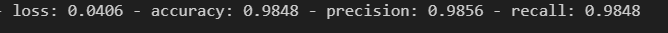
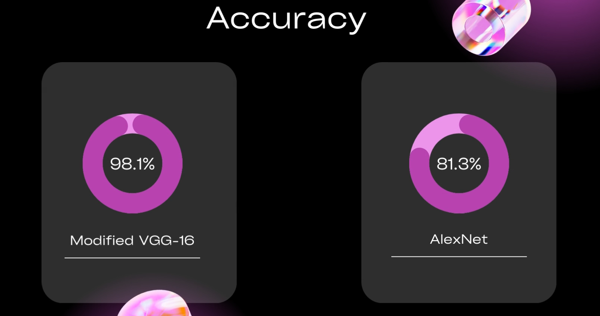

# Kidney-Stone-Classifier

## Overview

The Kidney Stone Classifier is a deep learning project that aims to classify kidney stones into four categories: Normal, Cyst, Stone, and Tumor. The project utilizes a modified version of the VGG16 deep learning model to achieve accurate and efficient kidney stone classification. The modified model outperforms the original VGG16, AlexNet, MobileNet, and EfficientNet CNN models, making it a powerful tool for accurate diagnosis.

## Dataset

The dataset used for training and testing the classifier is sourced from Kaggle and can be found at the following link: [Kaggle Dataset]([https://www.kaggle.com/your/kidney-stone-dataset](https://www.kaggle.com/datasets/harshghadiya/kidneystone))


## Model Architecture

The modified VGG16 model architecture has been designed to improve the performance of kidney stone classification. It includes 13 layers instead on the original 15 layers. The 13 layers comprises of 8 layers of comvolution and max pooling and 5 dense and flatten layers.

## Installation

1. Clone the repository:

```bash
git clone https://github.com/mohaneesh-03/Kidney-Stone-Classifier.git
cd Kidney-Stone-Classifier
```
2. Set up a virtual environment (optional but recommended):
```bash
# Create a virtual environment
python -m venv venv

# Activate the virtual environment (Windows)
venv\Scripts\activate

# Activate the virtual environment (Linux/Mac)
source venv/bin/activate
```
3. Install the required dependencies:
```bash
pip install pandas
pip install numpy
pip install tenssorflow
pip install matplotlib
pip install os
```

4. Import the training, testing and validating set from the kaggle dataset


## Training

To train the modified VGG16 model on the kidney stone dataset, run the following command:

```bash
model = tf.keras.models.Sequential([
  
    tf.keras.layers.Conv2D(32,(3,3),strides=(1, 1),activation='relu',padding='VALID', input_shape=training_set.image_shape), 
    tf.keras.layers.MaxPooling2D(pool_size=(2,2)),#know conv2d and MaxPooling2D, using 0 padding, and stride is how you move across
    
    tf.keras.layers.Conv2D(64,(3,3),strides=(1, 1), activation='relu'),
    tf.keras.layers.MaxPooling2D(pool_size=(2,2)),

    tf.keras.layers.Conv2D(128,(3,3),strides=(1, 1), activation='relu'),
    tf.keras.layers.MaxPooling2D(pool_size=(2,2)),

    tf.keras.layers.Conv2D(256,(3,3),strides=(1, 1),activation='relu'),
    tf.keras.layers.MaxPooling2D(pool_size=(2,2)),


    tf.keras.layers.Flatten(),#Dimensionality reduction

    tf.keras.layers.Dense(128, activation='relu'),
    tf.keras.layers.Dense(64, activation='relu'),
    tf.keras.layers.Dense(32, activation='relu'),
    tf.keras.layers.Dense(4, activation='softmax')
])
```
```bash
model.compile(optimizer='rmsprop', loss='categorical_crossentropy', metrics=['accuracy',keras.metrics.Precision(name='precision'),keras.metrics.Recall(name='recall')]) 
```
```bash
m1= model.fit(training_set, validation_data=val_set,batch_size=150,epochs=3)
```

The training script will load the dataset, preprocess the images, and train the model using a specified number of epochs and batch size.

## Evaluation
To evaluate the trained model's performance on the test dataset, run the following command:

```bash
model.evaluate(test_set)
```

The evaluation script will load the trained model and display various metrics such as accuracy, precision, recall, and F1-score.

## Usage
After training and evaluating the model, you can use it to make predictions on new kidney stone images. Simply run the predict.py script and provide the path to the new image:

```bash
test_labels = test_set.classes
y_pred1 = model2.predict(test_set)
y_pred_classes1 = np.argmax(y_pred1, axis=1)
```

The script will load the trained model, preprocess the image, and output the predicted class label.

## Results
The modified VGG16 model has demonstrated superior performance compared to the original VGG16, AlexNet, MobileNet, and EfficientNet CNN models. It achieves higher accuracy and better generalization, making it an ideal choice for kidney stone classification tasks.




For comparison


## Contributing
Contributions to this project are welcome. If you find any bugs, have suggestions for improvements, or want to add new features, please open an issue or submit a pull request.


## Contact
If you have any questions or need further assistance, feel free to contact us at your@email.com.
